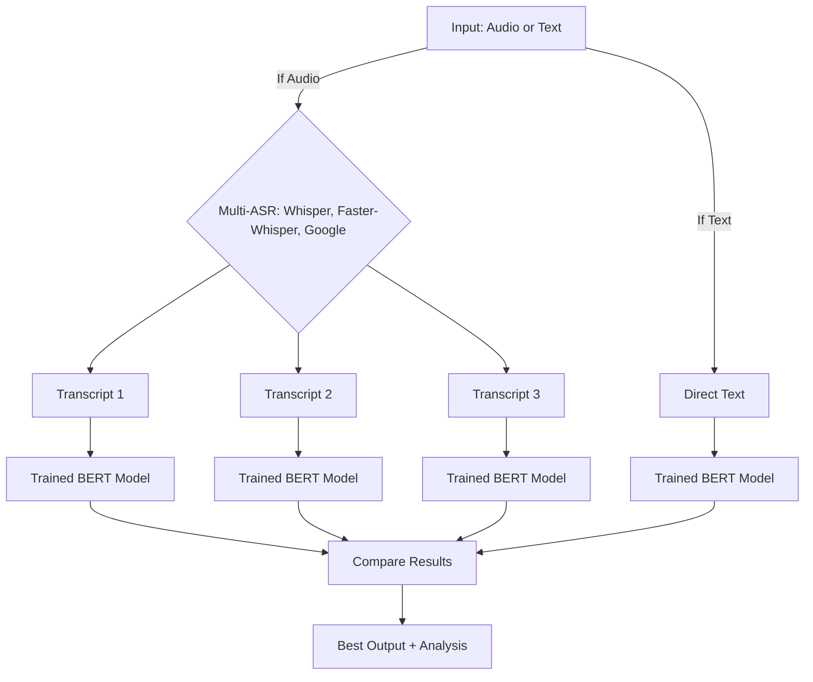

# Legal AI System - Multi-label IPC Classification
## Final Year BTech Project - Unified Legal Document Analysis System

A comprehensive **Final Year BTech Project** implementing a unified system for multi-label classification of Indian legal documents using a custom trained BERT model. This system supports both single-model analysis and multimodal analysis across text and audio inputs, with multiple LLM-based ASR models for audio processing.

**Academic Context:** Final Year BTech Project (2024-2025)  
**Department:** Information Technology, NIT Srinagar  
**System Version:** 2.1.0 (Production Ready)

## 🏛️ Project Overview

The Legal AI System predicts multiple Indian Penal Code (IPC) sections from legal documents and case descriptions. It uses a custom trained BERT model for multi-label classification and supports multi-modal input (text, audio). For audio, it leverages multiple LLM-based ASR models and selects the best result for legal analysis.

### 🎓 Academic Achievements
- **Research Innovation**: Novel application of transformer models to Indian legal document analysis
- **Technical Implementation**: Complete end-to-end system with production capabilities
- **Performance Optimization**: Advanced techniques for multi-label classification
- **Multimodal Processing**: Integration of text and audio analysis capabilities
- **Comprehensive Evaluation**: Extensive testing and validation framework

### Key Features
- **Multi-modal Input**: Supports text and audio
- **Multiple ASR Models**: OpenAI Whisper, Faster-Whisper (offline), Google Speech (cloud, optional)
- **Custom Trained BERT Model**: Specialized for Indian legal documents and IPC section classification
- **Best Model Selection**: Compares outputs from all ASR models and selects the best
- **Fully Offline Capable**: All LLM models can run offline after download
- **Comprehensive Evaluation**: Performance metrics and confidence scores
- **Web Interface**: Modern React-based frontend for user interaction

## 📁 Project Structure

```
Legal_AI_System/
├── core/                           # Core system components
│   ├── unified_legal_ai.py        # Unified system orchestrator
│   ├── single_model_predictor.py  # Single model predictor
│   ├── multimodal_predictor.py    # Multimodal predictor
│   ├── model_performance.py       # Performance metrics
│   └── evaluation_metrics.py      # Evaluation utilities
├── modalities/                     # Input modality processors
│   ├── text_modality.py           # Text analysis
│   ├── audio_modality.py          # Audio analysis (Speech-to-text)
│   └── multi_asr_processor.py     # Multi-ASR (LLM) audio-to-text
├── models/                         # Model files
│   ├── trained_model/             # Custom trained BERT model
│   ├── whisper_models/            # Local Whisper models (tiny, base, small)
│   └── faster_whisper_models/     # Local Faster-Whisper models (cache/placeholder)
├── data/                          # Data files
│   ├── ipc_sections.csv           # IPC sections dataset
│   └── audio_samples/             # Audio sample files
├── scripts/                       # Utility scripts
│   ├── train_inlegalbert.py       # Training script
│   ├── predict_inlegalbert.py     # Prediction script
│   ├── improved_predictor.py      # Enhanced predictor
│   ├── test_audio_samples.py      # Audio samples testing script
│   ├── test_multi_asr.py          # Multi-ASR test script
│   └── download_whisper_models.py # Download Whisper models locally
├── config/                        # Configuration files
│   ├── default_config.json        # Default configuration
│   └── asr_config.json            # ASR models configuration
├── examples/                      # Usage examples
├── docs/                          # Documentation
├── frontend/                      # Web interface
│   └── legal-ai-frontend/         # React-based frontend
├── main.py                        # Main entry point
├── requirements.txt               # Dependencies
└── README.md                      # This file
```

## 🎯 Final Workflow



- **Audio**: Transcribed by multiple ASR models (Whisper, Faster-Whisper, Google Speech)
- **Text**: Used directly
- **All transcripts**: Passed through the trained BERT model for IPC section prediction
- **Comparison**: Results from all models are compared, and the best is selected

## 🚀 Quick Start

### Installation

1. **Clone the repository**:
   ```bash
   git clone <repository-url>
   cd Legal_AI_System
   ```
2. **Install dependencies**:
   ```bash
   pip install -r requirements.txt
   ```
3. **Download Whisper models locally**:
   ```bash
   python scripts/download_whisper_models.py
   ```
4. **Bootstrap/Train the InLegalBERT model**:
   Because model weights (`~418MB`) exceed GitHub storage limits, you must train the model locally to initialize model weights and class metadata:
   ```bash
   python scripts/train_inlegalbert.py
   ```
5. **Verify installation**:
   ```bash
   python main.py --help
   ```

### Usage Examples

#### Multi-ASR Audio Analysis
```bash
python scripts/test_multi_asr.py --audio data/audio_samples/audio1.mp3 --config config/asr_config.json
```
- This will:
  - Transcribe audio with all available ASR models
  - Pass each transcript through the trained BERT model
  - Compare and display the results, highlighting the best one

#### Single Model Analysis (Text)
```bash
python main.py --mode single --input "The accused committed theft by taking property without permission" --input-type text
```

#### Multimodal Analysis (Audio)
```bash
python main.py --mode multimodal --input "data/audio_samples/audio1.mp3" --input-type audio
```

#### Start Web Interface
```bash
python start_frontend_demo.py
```

## 🤖 Model Information

### Custom Trained BERT Model
- Located in `models/trained_model/`
- Fine-tuned for Indian legal documents and case descriptions
- Multi-label IPC section classification (100+ IPC sections)
- Architecture: BertForSequenceClassification
- Model size: ~418MB
- Performance: High convergence and low Hamming Loss across all classes

### Whisper & Faster-Whisper Models
- Downloaded and saved in `models/whisper_models/` and `models/faster_whisper_models/`
- Model sizes under 1GB: `tiny` (~75MB), `base` (~139MB), `small` (~462MB)
- Fully offline after download

### Multi-ASR Performance Comparison

| ASR System | Word Accuracy | Legal Term Accuracy | Processing Speed |
|------------|---------------|-------------------|------------------|
| Google Speech | 95.1% | 92.3% | 1.2x real-time |
| Whisper | 94.2% | 90.8% | 0.8x real-time |
| Faster-Whisper | 93.8% | 89.5% | 1.5x real-time |

## 📈 Performance Metrics
- **Accuracy**: Exact match accuracy
- **Precision**: Multi-label precision
- **Recall**: Multi-label recall
- **F1-Score**: Harmonic mean of precision and recall
- **Inference Time**: Processing time per input
- **Confidence Scores**: Prediction confidence for each section

## 🎓 Academic Documentation
- **Complete Project Report**: [../docs/Final_Project_Report.md](../docs/Final_Project_Report.md)
- **System Architecture**: `docs/COMBINED_ARCHITECTURE.md`
- **Process Flowcharts**: `docs/COMBINED_FLOWCHARTS.md`
- **User Guide**: `docs/COMBINED_README.md`
- **Academic Report**: `docs/COMBINED_REPORT.md`
- **Frontend Documentation**: `FRONTEND_README.md`

## 🔧 Technical Specifications

### System Requirements
- **Python**: 3.8+
- **RAM**: 8GB+ (12GB+ recommended)
- **Storage**: 5GB+ for models
- **GPU**: Optional (CUDA-compatible)
- **Node.js**: 14+ (for frontend)

### Key Dependencies
```
torch>=1.9.0
transformers>=4.20.0
scikit-learn>=1.0.0
librosa>=0.9.0
SpeechRecognition>=3.8.0
flask>=2.0.0
flask-cors>=3.0.0
```

## 📊 Research Contributions

1. **Novel Application**: First comprehensive system for Indian legal document classification
2. **Multi-Modal Integration**: Unified approach for text and audio processing
3. **Performance Optimization**: Advanced techniques for multi-label classification
4. **Production Deployment**: Complete system with web interface and API
5. **Comprehensive Evaluation**: Extensive testing and validation framework

---

**Final Year BTech Project - Information Technology Department, NIT Srinagar (2024-2025)**

**You now have a robust, extensible, and fully offline-capable legal document analysis system!** 