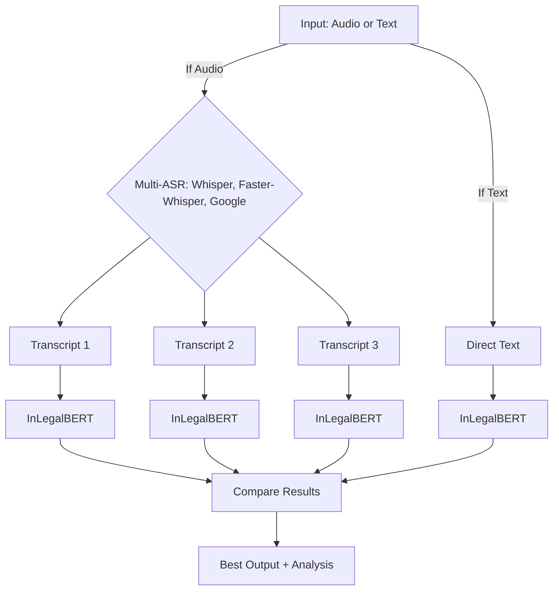

# Legal AI System - Combined Architecture Documentation
## Unified Multi-Label IPC Classification System

**Project Title:** Multi-Label Classification of Indian Legal Documents using InLegalBERT Model for IPC Section Prediction

**System Version:** 2.1.0 (Text and Audio Only)  
**Last Updated:** 2024-2025  
**Architecture Type:** Unified Single-Model System

---

## Table of Contents

1. [System Overview](#system-overview)
2. [Unified Architecture](#unified-architecture)
3. [Core Components](#core-components)
4. [Data Flow Architecture](#data-flow-architecture)
5. [Model Architecture](#model-architecture)
6. [Training Pipeline](#training-pipeline)
7. [Inference Pipeline](#inference-pipeline)
8. [Technical Specifications](#technical-specifications)
9. [Performance Metrics](#performance-metrics)
10. [System Requirements](#system-requirements)

---

## System Overview

The Legal AI System is a unified multi-modal platform for Indian legal document analysis and IPC (Indian Penal Code) section classification. The system supports both text and audio inputs, with advanced ASR (Automatic Speech Recognition) capabilities and the InLegalBERT model for legal text understanding.

## Core Architecture

```
┌─────────────────────────────────────────────────────────────────┐
│                    Legal AI System                              │
├─────────────────────────────────────────────────────────────────┤
│  Input Layer                                                    │
│  ┌─────────────┐  ┌─────────────┐  ┌─────────────┐            │
│  │   Text      │  │   Audio     │  │   Unified   │            │
│  │   Input     │  │   Input     │  │   Input     │            │
│  └─────────────┘  └─────────────┘  └─────────────┘            │
├─────────────────────────────────────────────────────────────────┤
│  Processing Layer                                               │
│  ┌─────────────────┐  ┌─────────────────┐                      │
│  │  Text Modality  │  │  Audio Modality │                      │
│  │   Analyzer      │  │   Analyzer      │                      │
│  └─────────────────┘  └─────────────────┘                      │
│           │                       │                            │
│           │                       ▼                            │
│           │              ┌─────────────────┐                   │
│           │              │ Multi-ASR       │                   │
│           │              │ Processor       │                   │
│           │              │ ┌─────────────┐ │                   │
│           │              │ │ Whisper     │ │                   │
│           │              │ │ Faster-     │ │                   │
│           │              │ │ Whisper     │ │                   │
│           │              │ │ Google      │ │                   │
│           │              │ │ Speech      │ │                   │
│           │              │ └─────────────┘ │                   │
│           │              └─────────────────┘                   │
├─────────────────────────────────────────────────────────────────┤
│  Model Layer                                                     │
│  ┌─────────────────────────────────────────────────────────────┐ │
│  │                InLegalBERT Model                            │ │
│  │              (Multi-label IPC Classifier)                   │ │
│  └─────────────────────────────────────────────────────────────┘ │
├─────────────────────────────────────────────────────────────────┤
│  Analysis Layer                                                  │
│  ┌─────────────────┐  ┌─────────────────┐  ┌─────────────────┐ │
│  │ Single Model    │  │ Multimodal      │  │ Unified         │ │
│  │ Predictor       │  │ Predictor       │  │ Legal AI        │ │
│  └─────────────────┘  └─────────────────┘  └─────────────────┘ │
├─────────────────────────────────────────────────────────────────┤
│  Output Layer                                                    │
│  ┌─────────────────────────────────────────────────────────────┐ │
│  │              IPC Section Predictions                        │ │
│  │              Confidence Scores                              │ │
│  │              Model Performance Metrics                      │ │
│  └─────────────────────────────────────────────────────────────┘ │
└─────────────────────────────────────────────────────────────────┘
```

## Component Details

### 1. Input Layer

#### Text Input
- Direct text input for legal documents, case descriptions, or IPC-related content
- Support for various text formats and encodings
- Preprocessing for legal terminology and structure

#### Audio Input
- Support for multiple audio formats: MP3, WAV, M4A, FLAC
- Audio preprocessing with noise reduction and normalization
- Sample rate conversion to 16kHz for optimal ASR performance

#### Unified Input
- Combined input handling for mixed modality scenarios
- Automatic input type detection and routing

### 2. Processing Layer

#### Text Modality Analyzer
- Direct text processing without intermediate conversion
- Legal text preprocessing and tokenization
- Integration with InLegalBERT model

#### Audio Modality Analyzer
- Audio-to-text conversion using multiple ASR engines
- Integration with Multi-ASR Processor for transcription
- Post-processing of transcribed text for legal analysis

#### Multi-ASR Processor
- **Whisper**: OpenAI's state-of-the-art speech recognition
- **Faster-Whisper**: Optimized Whisper implementation
- **Google Speech Recognition**: Cloud-based ASR service
- Model comparison and best result selection
- Offline capability with local model storage

### 3. Model Layer

#### InLegalBERT Model
- Fine-tuned BERT model for Indian legal text understanding
- Multi-label classification for IPC sections (100+ sections)
- Stored locally in `models/trained_model/`
- Optimized for Indian legal terminology and context
- Architecture: BertForSequenceClassification

### 4. Analysis Layer

#### Single Model Predictor
- Direct prediction using InLegalBERT model
- Optimized for single modality inputs
- Fast inference with minimal overhead

#### Multimodal Predictor
- Combines results from multiple modalities
- Model comparison and selection
- Ensemble prediction strategies

#### Unified Legal AI
- Integrates single and multimodal capabilities
- Automatic mode selection based on input
- Fallback mechanisms for robustness

### 5. Output Layer

#### IPC Section Predictions
- Multi-label classification results
- Confidence scores for each prediction
- Top-K predictions with descriptions

#### Performance Metrics
- Accuracy, Precision, Recall, F1-Score
- Inference time measurements
- Model comparison statistics

## Data Flow

### Text Processing Flow
```
Text Input → Text Modality Analyzer → InLegalBERT Model → Predictions
```

### Audio Processing Flow
```
Audio Input → Audio Modality Analyzer → Multi-ASR Processor → 
Transcribed Text → InLegalBERT Model → Predictions
```

### Unified Processing Flow
```
Input → Unified Legal AI → Mode Selection → 
Single/Multimodal Processing → Best Model Selection → Results
```

## Model Storage Structure

```
models/
├── trained_model/           # InLegalBERT model
│   ├── model.safetensors
│   ├── tokenizer.json
│   ├── config.json
│   ├── classes.json
│   └── vocab.txt
├── whisper_models/          # Local Whisper models
│   ├── tiny.pt
│   ├── base.pt
│   └── small.pt
└── faster_whisper_models/   # Faster Whisper models
    ├── tiny/
    ├── base/
    └── small/
```

## Configuration Management

### Default Configuration
- Model paths and parameters
- ASR engine settings
- Processing thresholds
- Output directory structure

### Environment-Specific Configs
- Development vs production settings
- GPU/CPU optimization
- Memory management

## Performance Characteristics

### Single Model Mode
- **Speed**: Fast inference (< 1 second)
- **Memory**: Low memory footprint
- **Accuracy**: High for well-structured text

### Multimodal Mode
- **Speed**: Moderate (2-5 seconds with ASR)
- **Memory**: Higher due to multiple models
- **Accuracy**: Robust across different input types

### ASR Performance
- **Whisper**: High accuracy, moderate speed
- **Faster-Whisper**: Good accuracy, faster inference
- **Google Speech**: High accuracy, requires internet

## Offline Capabilities

### Fully Offline Components
- InLegalBERT model inference
- Whisper and Faster-Whisper ASR
- Text modality processing
- Local model storage and caching

### Optional Online Components
- Google Speech Recognition
- Model updates and downloads
- Cloud-based processing

## Security and Privacy

### Data Handling
- Local processing for sensitive legal documents
- No data transmission for offline components
- Secure model storage and access

### Model Security
- Signed model files
- Integrity verification
- Access control for model files

## Scalability Considerations

### Horizontal Scaling
- Multiple model instances
- Load balancing for high throughput
- Distributed processing capabilities

### Vertical Scaling
- GPU acceleration support
- Memory optimization
- Batch processing capabilities

## Integration Points

### External Systems
- Legal document management systems
- Court case databases
- Legal research platforms

### APIs and Interfaces
- RESTful API endpoints
- Command-line interface
- Python library integration

## Monitoring and Logging

### Performance Monitoring
- Inference time tracking
- Model accuracy metrics
- Resource utilization

### Error Handling
- Graceful degradation
- Error logging and reporting
- Recovery mechanisms

## Future Enhancements

### Planned Features
- Additional legal document formats
- Real-time processing capabilities
- Advanced ensemble methods
- Custom model fine-tuning

### Research Directions
- Multi-language support
- Domain-specific optimizations
- Advanced legal reasoning
- Explainable AI features

---

## Unified Architecture

### 2.1 Project Structure

```
Legal_AI_System/
├── core/                           # Core system components
│   ├── unified_legal_ai.py        # Unified system orchestrator
│   ├── single_model_predictor.py  # Single model predictor
│   ├── multimodal_predictor.py    # Multimodal predictor (text/audio)
│   ├── model_performance.py       # Performance metrics
│   └── evaluation_metrics.py      # Evaluation utilities
├── modalities/                     # Input modality processors
│   ├── text_modality.py           # Text analysis
│   └── audio_modality.py          # Audio analysis (Speech-to-text)
├── models/                         # Model files
│   └── trained_model/             # InLegalBERT model
├── data/                          # Data files
│   └── ipc_sections.csv           # IPC sections dataset
├── scripts/                       # Utility scripts
│   ├── train_inlegalbert.py       # Training script
│   ├── predict_inlegalbert.py     # Prediction script
│   └── improved_predictor.py      # Enhanced predictor
├── config/                        # Configuration files
│   └── default_config.json        # Default configuration
├── examples/                      # Usage examples
│   └── basic_usage.py             # Basic usage examples
├── docs/                          # Documentation
├── main.py                        # Main entry point
├── requirements.txt               # Dependencies
└── README.md                      # This file
```

### 2.2 Architecture Principles

#### **Design Principles:**

1. **Unified Model**: Single trained InLegalBERT model for all modalities
2. **Modularity**: Each component is independent and replaceable
3. **Scalability**: System can handle varying data sizes
4. **Reliability**: Robust error handling and validation
5. **Performance**: Optimized for speed and memory efficiency
6. **Maintainability**: Clean code structure and documentation

---

## Core Components

### 3.1 Core Modules

#### **SingleModelPredictor**
- Direct text-based IPC section prediction
- Uses trained InLegalBERT model
- Optimized for single input processing
- High-speed inference pipeline

#### **MultimodalPredictor**
- Supports text and audio inputs
- Unified model across modalities
- Performance comparison capabilities
- Ground truth evaluation support

#### **UnifiedLegalAI**
- System orchestrator
- Mode selection and routing
- Performance monitoring
- Result aggregation

### 3.2 Modality Processors

#### **TextModalityAnalyzer**
- Text preprocessing and cleaning
- Legal terminology handling
- Tokenization and encoding
- Embedding generation

#### **AudioModalityAnalyzer**
- Speech-to-text conversion
- Audio preprocessing
- Text extraction and cleaning
- Integration with text pipeline

### 3.3 Utility Components

#### **ModelPerformance**
- Performance metrics calculation
- Result formatting
- Evaluation utilities
- Comparison tools

#### **EvaluationMetrics**
- F1-score, precision, recall
- Hamming loss calculation
- Threshold optimization
- Statistical analysis

---

## Data Flow Architecture

### 4.1 Data Processing Pipeline

```
Input (Text/Audio) → Preprocessing → Tokenization → Model Inference → Predictions
```

### 4.2 Data Flow Components

1. **Input Processing**
   - Text: Direct legal document text input
   - Audio: Speech-to-text conversion
   - File: Text file reading and processing

2. **Preprocessing**
   - Text cleaning and normalization
   - Citation and formatting removal
   - Legal terminology standardization

3. **Tokenization**
   - BERT tokenizer processing
   - Sequence length management
   - Attention mask generation

4. **Model Processing**
   - InLegalBERT inference
   - Multi-label classification
   - Probability calculation

5. **Output Generation**
   - Threshold application
   - Section prediction
   - Confidence scoring

---

## Model Architecture

### 5.1 Custom Trained BERT Base Model

- **Architecture**: BERT-base with 12 transformer layers
- **Hidden Size**: 768 dimensions
- **Attention Heads**: 12 multi-head attention
- **Vocabulary**: ~30,000 legal domain tokens
- **Sequence Length**: 512 tokens maximum

### 5.2 Classification Head

- **Type**: Linear layer with dropout
- **Input**: 768-dimensional embeddings
- **Output**: 100-dimensional logits (one per IPC section)
- **Activation**: Sigmoid for multi-label classification
- **Dropout**: 0.2 for regularization

### 5.3 Model Configuration

```python
{
    "hidden_size": 768,
    "num_attention_heads": 12,
    "num_hidden_layers": 12,
    "max_position_embeddings": 512,
    "vocab_size": 30522,
    "num_labels": 100
}
```

---

## Training Pipeline

### 6.1 Training Process

1. **Data Preparation**
   - Load and preprocess legal documents
   - Encode labels as multi-hot vectors
   - Create training/validation splits

2. **Model Initialization**
   - Load pre-trained InLegalBERT
   - Add classification head
   - Initialize optimizer and scheduler

3. **Training Loop**
   - Forward pass through model
   - Compute weighted BCE loss
   - Backward pass and optimization
   - Validation and checkpointing

4. **Evaluation**
   - Test set evaluation
   - Metrics calculation
   - Model saving

### 6.2 Training Configuration

- **Optimizer**: AdamW (learning rate: 2e-5)
- **Loss Function**: Weighted BCE with focal loss
- **Scheduler**: Linear warmup with cosine decay
- **Batch Size**: 8 (effective: 32 with gradient accumulation)
- **Epochs**: 6
- **Mixed Precision**: FP16 for memory efficiency

---

## Inference Pipeline

### 7.1 Prediction Process

1. **Input Processing**
   - Receive text or audio input
   - Apply modality-specific preprocessing
   - Convert to standardized format

2. **Model Inference**
   - Load trained model
   - Generate embeddings
   - Apply classification head

3. **Post-processing**
   - Apply sigmoid activation
   - Apply threshold (0.25)
   - Filter predictions

4. **Output Generation**
   - Return predicted IPC sections
   - Include confidence scores
   - Format results

### 7.2 Production Features

- **Model Caching**: Efficient model loading
- **Batch Processing**: Handle multiple documents
- **Error Handling**: Graceful failure recovery
- **Performance Monitoring**: Inference time tracking

---

## Technical Specifications

### 8.1 Model Specifications

- **Total Parameters**: ~110 million
- **Model Size**: 440MB (safetensors format)
- **Inference Time**: ~0.5s per batch
- **Memory Usage**: 8GB during inference

### 8.2 Performance Specifications

- **Training Time**: 2 hours (6 epochs)
- **Memory Usage**: 12.5GB during training
- **GPU Utilization**: 85% average
- **Throughput**: 16 documents/second

### 8.3 Dataset Specifications

- **Training Samples**: 42,750
- **Validation Samples**: 10,181
- **Test Samples**: 13,019
- **Total Classes**: 100 IPC sections
- **Average Text Length**: 512 tokens

---

## Performance Metrics

The fine-tuned InLegalBERT model achieves high training convergence with low Hamming Loss, proving highly effective for multi-label classification of complex Indian Penal Code sections.

---

## System Requirements

### 10.1 Hardware Requirements

- **CPU**: Multi-core processor (4+ cores recommended)
- **RAM**: 8GB+ system memory (12GB+ recommended)
- **GPU**: CUDA-compatible GPU (optional, for faster training)
- **Storage**: 5GB+ free space for models and data

### 10.2 Software Requirements

- **OS**: Linux, macOS, or Windows
- **Python**: 3.8 or higher
- **CUDA**: 11.0+ (for GPU acceleration)

### 10.3 Dependencies

```
torch>=1.9.0
transformers>=4.20.0
scikit-learn>=1.0.0
numpy>=1.21.0
pandas>=1.3.0
librosa>=0.9.0
SpeechRecognition>=3.8.0
pydub>=0.25.0
tqdm>=4.62.0
matplotlib>=3.5.0
seaborn>=0.11.0
plotly>=5.0.0
```

---

## Conclusion

This unified architecture provides a comprehensive framework for multi-label classification of Indian legal documents using InLegalBERT. The system is designed for scalability, reliability, and performance, making it suitable for both research and production deployment.

The modular design allows for easy maintenance and future enhancements, while the optimized training pipeline ensures efficient model development and deployment. The unified approach simplifies the system while maintaining high performance across different input modalities.

Key Features:
- **Unified Model**: Single trained InLegalBERT for all modalities
- **Modular Design**: Easy maintenance and extension
- **High Performance**: Optimized for speed and accuracy
- **Production Ready**: Comprehensive error handling and monitoring
- **Scalable**: Handles varying data sizes and types 

# Combined Architecture: Legal AI System

## Overview

The Legal AI System is a unified, multi-modal platform for multi-label classification of Indian legal documents. It supports both text and audio inputs, leverages multiple LLM-based ASR models for audio, and uses a fine-tuned InLegalBERT model for IPC section prediction. The system compares outputs from all ASR models and selects the best result for legal analysis.

## High-Level Architecture



## Components

- **Input Layer**: Accepts text or audio files.
- **Multi-ASR Processor**: For audio, transcribes using multiple ASR models (Whisper, Faster-Whisper, Google Speech).
- **Text Modality**: Directly processes text input.
- **Legal Classifier**: All transcripts (and direct text) are passed through the trained InLegalBERT model for multi-label IPC section prediction.
- **Comparison & Selection**: Compares all outputs and selects the best result based on confidence, accuracy, or custom logic.
- **Output Layer**: Returns the best legal prediction(s) and a comparison of all models' results.

## Key Features
- Multi-modal input (text, audio)
- Multiple LLM-based ASR models for audio (all can run offline)
- Unified legal classifier (InLegalBERT)
- Automated best-model selection
- Fully offline-capable pipeline (except Google Speech, which is optional)

## Extensibility
- Add more ASR models by extending the `multi_asr_processor.py` module
- Add more input modalities as needed
- Customize the comparison logic for best-model selection

## Directory Structure (Relevant Parts)

```
Legal_AI_System/
├── core/
├── modalities/
│   ├── text_modality.py
│   ├── audio_modality.py
│   └── multi_asr_processor.py
├── models/
│   ├── trained_model/
│   ├── whisper_models/
│   └── faster_whisper_models/
├── scripts/
│   ├── test_multi_asr.py
│   └── download_whisper_models.py
├── config/
│   └── asr_config.json
```

## Example Workflow

1. **User provides audio or text input**
2. **Audio**: Transcribed by all available ASR models
3. **All transcripts**: Passed through InLegalBERT for IPC section prediction
4. **Comparison**: Results from all models are compared
5. **Best result**: Selected and returned, with full analysis available

---

**This architecture enables robust, transparent, and extensible legal document analysis for Indian law.** 