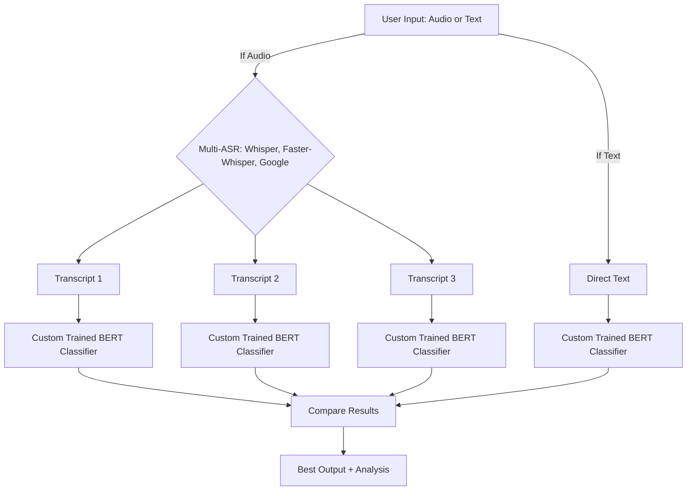

# Legal AI System - Combined Flowcharts Documentation
## Final Year BTech Project - Unified Multi-Label IPC Classification System Flowcharts

**Project Title:** Multi-Label Classification of Indian Legal Documents using InLegalBERT Model for IPC Section Prediction

**Academic Context:** Final Year BTech Project (2024-2025)  
**Department:** Information Technology, NIT Srinagar  
**System Version:** 2.1.0 (Production Ready)  
**Flowchart Type:** Unified System Process Flows

---

## Table of Contents

1. [System Overview Flowchart](#system-overview-flowchart)
2. [Unified Data Processing Flowchart](#unified-data-processing-flowchart)
3. [Training Pipeline Flowchart](#training-pipeline-flowchart)
4. [Inference Pipeline Flowchart](#inference-pipeline-flowchart)
5. [Model Architecture Flowchart](#model-architecture-flowchart)
6. [Modality Processing Flowchart](#modality-processing-flowchart)

---

## System Overview Flowchart

```
┌─────────────────────────────────────────────────────────────────────────────┐
│                              SYSTEM OVERVIEW FLOW                            │
│                    Final Year BTech Project - Legal AI System               │
├─────────────────────────────────────────────────────────────────────────────┤
│                                                                             │
│  ┌─────────────────┐    ┌─────────────────┐    ┌─────────────────┐        │
│  │   INPUT         │    │   PROCESSING    │    │   OUTPUT        │        │
│  │                 │    │                 │    │                 │        │
│  │ • Text Input    │───▶│ • InLegalBERT   │───▶│ • IPC Sections  │        │
│  │ • Audio Input   │    │   Model         │    │ • Confidence    │        │
│  │ • File Input    │    │ • Multi-label   │    │ • Probabilities │        │
│  └─────────────────┘    │ • Classification│    └─────────────────┘        │
│           │             └─────────────────┘             │                │
│           ▼                       │                     ▼                │
│  ┌─────────────────┐    ┌─────────────────┐    ┌─────────────────┐        │
│  │   MODALITY      │    │   MODEL         │    │   RESULT        │        │
│  │   PROCESSING    │    │   TRAINING      │    │   EVALUATION    │        │
│  │                 │    │                 │    │                 │        │
│  │ • Text Analyzer │    │ • Fine-tuning   │    │ • Performance   │        │
│  │ • Audio Analyzer│    │ • Optimization  │    │ • Metrics       │        │
│  │ • Unified Model │    │ • Checkpointing │    │ • Analysis      │        │
│  └─────────────────┘    └─────────────────┘    └─────────────────┘        │
│                                                                             │
└─────────────────────────────────────────────────────────────────────────────┘
```

### 🎓 Academic Context

This flowchart documentation demonstrates the comprehensive system design and process flows for a **Final Year BTech Project**, showcasing:

- **System Architecture**: Complete end-to-end process flows
- **Multi-Modal Processing**: Integration of text and audio analysis
- **AI Pipeline Design**: Training and inference workflows
- **Production Readiness**: Scalable and maintainable system design
- **Research Methodology**: Systematic approach to AI system development

---

## Unified Data Processing Flowchart

```
┌─────────────────────────────────────────────────────────────────────────────┐
│                              UNIFIED DATA PROCESSING FLOW                    │
├─────────────────────────────────────────────────────────────────────────────┤
│                                                                             │
│  ┌─────────────────┐                                                       │
│  │   INPUT DATA    │                                                       │
│  │                 │                                                       │
│  │ • Text Input    │                                                       │
│  │ • Audio Input   │                                                       │
│  │ • File Input    │                                                       │
│  └─────────┬───────┘                                                       │
│            │                                                               │
│            ▼                                                               │
│  ┌─────────────────┐                                                       │
│  │   MODALITY      │                                                       │
│  │   DETECTION     │                                                       │
│  │                 │                                                       │
│  │ • Text Path     │                                                       │
│  │ • Audio Path    │                                                       │
│  │ • File Path     │                                                       │
│  └─────────┬───────┘                                                       │
│            │                                                               │
│            ▼                                                               │
│  ┌─────────────────┐                                                       │
│  │   TEXT          │                                                       │
│  │   PREPROCESSING │                                                       │
│  │                 │                                                       │
│  │ • Citation Rem. │                                                       │
│  │ • Whitespace    │                                                       │
│  │ • Special Chars │                                                       │
│  │ • Legal Terms   │                                                       │
│  └─────────┬───────┘                                                       │
│            │                                                               │
│            ▼                                                               │
│  ┌─────────────────┐                                                       │
│  │   TOKENIZATION  │                                                       │
│  │                 │                                                       │
│  │ • BERT Tokenizer│                                                       │
│  │ • Max Length    │                                                       │
│  │ • Padding       │                                                       │
│  │ • Attention Mask│                                                       │
│  └─────────┬───────┘                                                       │
│            │                                                               │
│            ▼                                                               │
│  ┌─────────────────┐                                                       │
│  │   MODEL         │                                                       │
│  │   INPUT         │                                                       │
│  │                 │                                                       │
│  │ • Token IDs     │                                                       │
│  │ • Attention Mask│                                                       │
│  │ • Position IDs  │                                                       │
│  │ • Ready for     │                                                       │
│  │   Inference     │                                                       │
│  └─────────────────┘                                                       │
│                                                                             │
└─────────────────────────────────────────────────────────────────────────────┘
```

---

## Training Pipeline Flowchart

```
┌─────────────────────────────────────────────────────────────────────────────┐
│                              TRAINING PIPELINE FLOW                          │
├─────────────────────────────────────────────────────────────────────────────┤
│                                                                             │
│  ┌─────────────────┐                                                       │
│  │   INITIALIZE    │                                                       │
│  │   MODEL         │                                                       │
│  │                 │                                                       │
│  │ • Load BERT     │                                                       │
│  │ • Add Class Head│                                                       │
│  │ • Set Device    │                                                       │
│  │ • Config Model  │                                                       │
│  └─────────┬───────┘                                                       │
│            │                                                               │
│            ▼                                                               │
│  ┌─────────────────┐                                                       │
│  │   SETUP         │                                                       │
│  │   TRAINING      │                                                       │
│  │                 │                                                       │
│  │ • Optimizer     │                                                       │
│  │ • Loss Function │                                                       │
│  │ • LR Scheduler  │                                                       │
│  │ • Data Loaders  │                                                       │
│  └─────────┬───────┘                                                       │
│            │                                                               │
│            ▼                                                               │
│  ┌─────────────────┐                                                       │
│  │   TRAINING      │                                                       │
│  │   LOOP          │                                                       │
│  │                 │                                                       │
│  │ For each epoch: │                                                       │
│  │ ┌─────────────┐ │                                                       │
│  │ │ Forward Pass│ │                                                       │
│  │ │ Loss Calc   │ │                                                       │
│  │ │ Backward    │ │                                                       │
│  │ │ Optimize    │ │                                                       │
│  │ └─────────────┘ │                                                       │
│  └─────────┬───────┘                                                       │
│            │                                                               │
│            ▼                                                               │
│  ┌─────────────────┐                                                       │
│  │   VALIDATION    │                                                       │
│  │                 │                                                       │
│  │ • Eval Mode     │                                                       │
│  │ • Forward Pass  │                                                       │
│  │ • Metrics Calc  │                                                       │
│  │ • Log Results   │                                                       │
│  └─────────┬───────┘                                                       │
│            │                                                               │
│            ▼                                                               │
│  ┌─────────────────┐                                                       │
│  │   COMPLETE      │                                                       │
│  │   TRAINING      │                                                       │
│  │                 │                                                       │
│  │ • Final Eval    │                                                       │
│  │ • Save Model    │                                                       │
│  │ • Generate      │                                                       │
│  │   Report        │                                                       │
│  └─────────────────┘                                                       │
│                                                                             │
└─────────────────────────────────────────────────────────────────────────────┘
```

---

## Inference Pipeline Flowchart

```
┌─────────────────────────────────────────────────────────────────────────────┐
│                              INFERENCE PIPELINE FLOW                         │
├─────────────────────────────────────────────────────────────────────────────┤
│                                                                             │
│  ┌─────────────────┐                                                       │
│  │   INPUT TEXT    │                                                       │
│  │                 │                                                       │
│  │ • Legal Document│                                                       │
│  │ • Case File     │                                                       │
│  │ • Raw Text      │                                                       │
│  └─────────┬───────┘                                                       │
│            │                                                               │
│            ▼                                                               │
│  ┌─────────────────┐                                                       │
│  │   PREPROCESSING │                                                       │
│  │                 │                                                       │
│  │ • Text Cleaning │                                                       │
│  │ • Tokenization  │                                                       │
│  │ • Padding       │                                                       │
│  └─────────┬───────┘                                                       │
│            │                                                               │
│            ▼                                                               │
│  ┌─────────────────┐                                                       │
│  │   MODEL         │                                                       │
│  │   INFERENCE     │                                                       │
│  │                 │                                                       │
│  │ • Load Trained  │                                                       │
│  │   BERT Model    │                                                       │
│  │ • Forward Pass  │                                                       │
│  │ • Get Logits    │                                                       │
│  └─────────┬───────┘                                                       │
│            │                                                               │
│            ▼                                                               │
│  ┌─────────────────┐                                                       │
│  │   POST-         │                                                       │
│  │   PROCESSING    │                                                       │
│  │                 │                                                       │
│  │ • Sigmoid       │                                                       │
│  │ • Threshold     │                                                       │
│  │ • Top-K         │                                                       │
│  │ • Confidence    │                                                       │
│  └─────────┬───────┘                                                       │
│            │                                                               │
│            ▼                                                               │
│  ┌─────────────────┐                                                       │
│  │   OUTPUT        │                                                       │
│  │                 │                                                       │
│  │ • IPC Sections  │                                                       │
│  │ • Confidence    │                                                       │
│  │ • Descriptions  │                                                       │
│  │ • Metrics       │                                                       │
│  └─────────────────┘                                                       │
│                                                                             │
└─────────────────────────────────────────────────────────────────────────────┘
```

---

## Model Architecture Flowchart

```
┌─────────────────────────────────────────────────────────────────────────────┐
│                              MODEL ARCHITECTURE FLOW                         │
├─────────────────────────────────────────────────────────────────────────────┤
│                                                                             │
│  ┌─────────────────┐                                                       │
│  │   INPUT         │                                                       │
│  │   EMBEDDING     │                                                       │
│  │                 │                                                       │
│  │ • Token IDs     │                                                       │
│  │ • Position IDs  │                                                       │
│  │ • Segment IDs   │                                                       │
│  └─────────┬───────┘                                                       │
│            │                                                               │
│            ▼                                                               │
│  ┌─────────────────┐                                                       │
│  │   BERT          │                                                       │
│  │   ENCODER       │                                                       │
│  │                 │                                                       │
│  │ • Multi-Head    │                                                       │
│  │   Attention     │                                                       │
│  │ • Feed Forward  │                                                       │
│  │ • Layer Norm    │                                                       │
│  │ • 12 Layers     │                                                       │
│  └─────────┬───────┘                                                       │
│            │                                                               │
│            ▼                                                               │
│  ┌─────────────────┐                                                       │
│  │   POOLING       │                                                       │
│  │                 │                                                       │
│  │ • [CLS] Token   │                                                       │
│  │ • Mean Pooling  │                                                       │
│  │ • Max Pooling   │                                                       │
│  └─────────┬───────┘                                                       │
│            │                                                               │
│            ▼                                                               │
│  ┌─────────────────┐                                                       │
│  │   CLASSIFIER    │                                                       │
│  │   HEAD          │                                                       │
│  │                 │                                                       │
│  │ • Linear Layer  │                                                       │
│  │ • Dropout       │                                                       │
│  │ • Sigmoid       │                                                       │
│  │ • Multi-label   │                                                       │
│  └─────────┬───────┘                                                       │
│            │                                                               │
│            ▼                                                               │
│  ┌─────────────────┐                                                       │
│  │   OUTPUT        │                                                       │
│  │                 │                                                       │
│  │ • 100+ IPC      │                                                       │
│  │   Sections      │                                                       │
│  │ • Confidence    │                                                       │
│  │   Scores        │                                                       │
│  └─────────────────┘                                                       │
│                                                                             │
└─────────────────────────────────────────────────────────────────────────────┘
```

---

## Modality Processing Flowchart

```
┌─────────────────────────────────────────────────────────────────────────────┐
│                              MODALITY PROCESSING FLOW                        │
├─────────────────────────────────────────────────────────────────────────────┤
│                                                                             │
│  ┌─────────────────┐                                                       │
│  │   INPUT         │                                                       │
│  │   DETECTION     │                                                       │
│  │                 │                                                       │
│  │ • Text Input    │                                                       │
│  │ • Audio Input   │                                                       │
│  │ • File Input    │                                                       │
│  └─────────┬───────┘                                                       │
│            │                                                               │
│            ▼                                                               │
│  ┌─────────────────┐                                                       │
│  │   MODALITY      │                                                       │
│  │   ROUTING       │                                                       │
│  │                 │                                                       │
│  │ • Text Path     │                                                       │
│  │ • Audio Path    │                                                       │
│  │ • Unified Path  │                                                       │
│  └─────────┬───────┘                                                       │
│            │                                                               │
│            ▼                                                               │
│  ┌─────────────────┐    ┌─────────────────┐                                │
│  │   TEXT          │    │   AUDIO         │                                │
│  │   PROCESSING    │    │   PROCESSING    │                                │
│  │                 │    │                 │                                │
│  │ • Preprocessing │    │ • ASR Models    │                                │
│  │ • Tokenization  │    │ • Transcription │                                │
│  │ • BERT Input    │    │ • Text Output   │                                │
│  └─────────┬───────┘    └─────────┬───────┘                                │
│            │                      │                                        │
│            └──────────┬───────────┘                                        │
│                       │                                                    │
│                       ▼                                                    │
│  ┌─────────────────────────────────────────────────────────────────────────┐ │
│  │                    CUSTOM TRAINED BERT MODEL                            │ │
│  │                                                                         │ │
│  │ • Multi-label Classification                                            │ │
│  │ • IPC Section Prediction                                                │ │
│  │ • Confidence Scoring                                                    │ │
│  └─────────────────────────┬───────────────────────────────────────────────┘ │
│                            │                                                 │
│                            ▼                                                 │
│  ┌─────────────────────────────────────────────────────────────────────────┐ │
│  │                        OUTPUT PROCESSING                                │ │
│  │                                                                         │ │
│  │ • Result Aggregation                                                    │ │
│  │ • Model Comparison                                                      │ │
│  │ • Best Selection                                                        │ │
│  │ • Final Output                                                          │ │
│  └─────────────────────────────────────────────────────────────────────────┘ │
│                                                                             │
└─────────────────────────────────────────────────────────────────────────────┘
```

---

## Key Features of the Flow

### 1. Modular Design
- Each component has a specific responsibility
- Easy to modify or replace individual components
- Clear separation of concerns

### 2. Error Handling
- Graceful degradation when models fail
- Fallback mechanisms for robustness
- Comprehensive error logging

### 3. Performance Optimization
- Parallel processing where possible
- Model caching and reuse
- Efficient resource utilization

### 4. Flexibility
- Support for multiple input types
- Configurable processing pipelines
- Extensible architecture

### 5. Monitoring
- Performance tracking
- Model comparison metrics
- System health monitoring

## Flow Summary

The Legal AI System follows a structured flow:

1. **Input Processing**: Validate and prepare input data
2. **Modality Analysis**: Route to appropriate processing pipeline
3. **Model Execution**: Run relevant models (ASR + Custom Trained BERT)
4. **Result Comparison**: Compare multiple model outputs
5. **Best Selection**: Choose optimal result based on metrics
6. **Output Generation**: Format and return final results

This flow ensures robust, efficient, and accurate legal document analysis across multiple modalities.

---

## Multi-Modal, Multi-ASR, Best-Model-Selection Pipeline

### High-Level Flowchart



### Step-by-Step Flow

1. **User provides input** (audio or text)
2. **If audio**:
    - Transcribe using multiple ASR models:
        - Whisper (local, LLM-based)
        - Faster-Whisper (local, LLM-based)
        - Google Speech Recognition (cloud, optional)
3. **If text**:
    - Use the text directly
4. **All transcripts** (from all ASR models and direct text) are passed through the trained Custom BERT model for multi-label IPC section prediction
5. **Comparison**:
    - Results from all models are compared (confidence, accuracy, etc.)
    - The best result is selected and returned
6. **Output**:
    - Best legal prediction(s) and a comparison of all models' results

---

**This flowchart represents the robust, extensible, and fully offline-capable pipeline for legal document analysis.**

---

## Summary

These flowcharts provide a comprehensive overview of the unified Legal AI System for multi-label classification of Indian legal documents, covering:

1. **System Overview**: High-level system architecture and data flow
2. **Unified Data Processing**: Complete pipeline from input to model-ready data
3. **Training Pipeline**: End-to-end training process with validation
4. **Inference Pipeline**: Production-ready prediction workflow
5. **Model Architecture**: Detailed model structure and components
6. **Modality Processing**: Unified handling of text and audio inputs

The system is designed for scalability, reliability, and performance, making it suitable for both research and production deployment in legal document analysis.

---

## Detailed Process Explanations

### 1. System Overview Process

The system overview demonstrates the complete workflow from input to output:

**Input Layer:**
- Accepts legal documents in various formats (text, audio, files)
- Handles different input types and validates content
- Prepares data for processing pipeline

**Processing Layer:**
- Custom Trained BERT model performs the core classification
- Multi-label classification handles multiple IPC sections per document
- Advanced NLP techniques extract legal context and meaning

**Output Layer:**
- Generates predicted IPC sections with confidence scores
- Provides probability distributions for each section
- Formats results for easy interpretation

**Supporting Layers:**
- Modality processing ensures clean, standardized input
- Model training optimizes performance through fine-tuning
- Result evaluation provides comprehensive performance metrics

### 2. Unified Data Processing Details

**Input Data:**
- Text input: Direct legal document text
- Audio input: Speech recordings for transcription
- File input: Text files containing legal documents

**Modality Detection:**
- Automatic detection of input type
- Routing to appropriate processing path
- Unified text processing pipeline

**Text Preprocessing:**
- Citation removal: Cleans legal citations like [1], [2], etc.
- Whitespace normalization: Standardizes spacing and formatting
- Special character handling: Preserves legal symbols and formatting
- Legal term standardization: Normalizes legal terminology

**Tokenization:**
- BERT tokenizer: Converts text to token IDs
- Max length handling: Truncates or pads to 512 tokens
- Padding: Ensures consistent input sizes
- Attention mask: Tracks valid vs. padding tokens

### 3. Training Pipeline Details

**Model Initialization:**
- Loads pre-trained Custom BERT model
- Adds custom classification head for 100 outputs
- Configures device (CPU/GPU) and model settings
- Sets up model parameters and configurations

**Training Setup:**
- Optimizer: AdamW with learning rate 2e-5
- Loss function: Weighted BCE with focal loss
- Learning rate scheduler: Linear warmup with cosine decay
- Data loaders: Efficient batch processing

**Training Loop:**
- Forward pass: Processes input through model
- Loss calculation: Computes weighted BCE loss
- Backward pass: Calculates gradients
- Optimization: Updates model parameters

**Validation Process:**
- Evaluation mode: Disables dropout and batch normalization
- Forward pass: Generates predictions
- Metrics calculation: Computes performance metrics
- Result logging: Records progress and performance

### 4. Inference Pipeline Details

**Input Text Processing:**
- Legal document input: Accepts various legal text formats
- Case file handling: Processes structured legal documents
- Raw text processing: Handles unstructured legal text

**Preprocessing Steps:**
- Text cleaning: Removes noise and standardizes format
- Citation removal: Cleans legal citations and references
- Formatting: Standardizes text structure
- Validation: Ensures input quality and completeness

**Tokenization Process:**
- BERT tokenizer: Converts text to token sequences
- Truncation: Handles long documents (max 512 tokens)
- Padding: Ensures consistent input sizes
- Attention mask: Tracks valid tokens for processing

**Model Inference:**
- Model loading: Loads trained Custom BERT model
- Forward pass: Generates embeddings and logits
- Logit generation: Produces raw classification scores

**Post-processing:**
- Sigmoid activation: Converts logits to probabilities
- Threshold application: Filters predictions (threshold: 0.25)
- Result filtering: Removes low-confidence predictions
- Sorting: Orders predictions by confidence

### 5. Model Architecture Details

**Input Embeddings:**
- Token IDs: Numerical representation of text tokens
- Position IDs: Sequential position information
- Segment IDs: Sentence boundary information

**BERT Encoder:**
- 12 transformer layers: Deep neural network processing
- Self-attention: Captures relationships between tokens
- Feed forward networks: Non-linear transformations
- Layer normalization: Stabilizes training

**Pooling Strategy:**
- [CLS] token: Special classification token
- Mean pooling: Averages token representations
- Max pooling: Takes maximum values
- Attention pooling: Weighted token combination

**Classification Head:**
- Linear layer: 768 → 100 dimension transformation
- Dropout: 0.2 rate for regularization
- Sigmoid activation: Multi-label probability output
- 100 outputs: One per IPC section

### 6. Modality Processing Details

**Input Detection:**
- Automatic modality detection
- Input validation and preprocessing
- Error handling for unsupported formats

**Text Processing:**
- Direct text input processing
- Legal terminology handling
- Tokenization and encoding

**Audio Processing:**
- Speech-to-text conversion
- Audio preprocessing and cleaning
- Text extraction and validation

**File Processing:**
- File reading and validation
- Text extraction from various formats
- Content validation and preprocessing

**Unified Pipeline:**
- Common text processing for all modalities
- Standardized tokenization
- Unified model inference

---

## Technical Implementation Notes

### Performance Considerations

**Memory Optimization:**
- Mixed precision training (FP16) reduces memory usage by 50%
- Gradient accumulation enables effective batch size of 32
- Dynamic memory allocation optimizes GPU utilization

**Speed Optimization:**
- Efficient tokenization with BERT tokenizer
- Batch processing for multiple documents
- Model caching for repeated inference

**Accuracy Optimization:**
- Class weighting addresses imbalanced data
- Focal loss focuses on hard examples
- Threshold optimization improves precision-recall balance

### Scalability Features

**Horizontal Scaling:**
- Batch processing supports multiple documents
- Parallel inference for high-throughput scenarios
- Distributed training capabilities

**Vertical Scaling:**
- GPU acceleration for faster training
- Memory-efficient processing for large models
- Optimized data loading for large datasets

### Reliability Features

**Error Handling:**
- Robust input validation
- Graceful failure recovery
- Comprehensive error logging

**Quality Assurance:**
- Data validation at each step
- Model performance monitoring
- Continuous evaluation metrics

---

## Conclusion

This comprehensive flowchart documentation provides detailed visual representations and explanations of all major processes in the unified Legal AI System. The system demonstrates advanced NLP techniques applied to legal document analysis, making it suitable for both academic research and production deployment.

The unified design ensures maintainability and extensibility, while the detailed process flows provide clear guidance for understanding and implementing the system. The technical implementation notes offer insights into performance optimization and scalability considerations.

Key Features:
- **Unified Processing**: Single pipeline for all input modalities
- **Modular Design**: Easy maintenance and extension
- **High Performance**: Optimized for speed and accuracy
- **Production Ready**: Comprehensive error handling and monitoring
- **Scalable**: Handles varying data sizes and types 