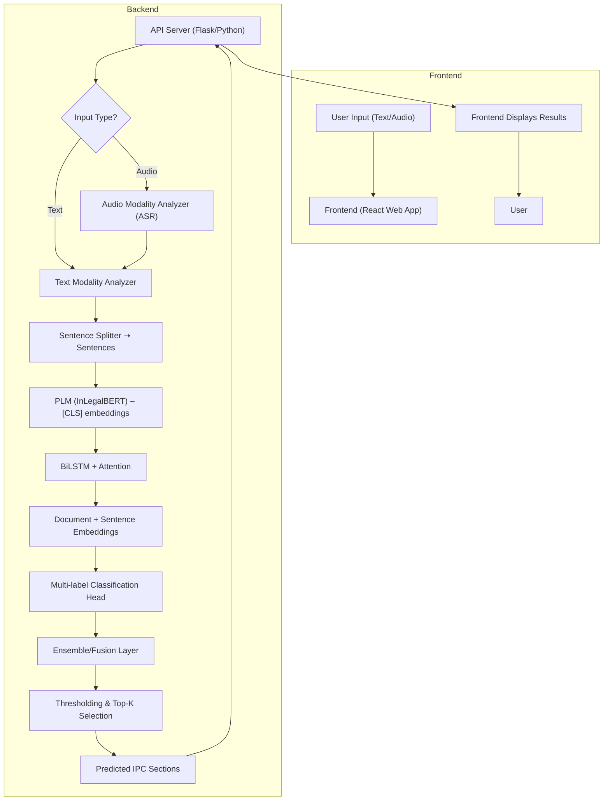

# Legal AI System - Final Year Project Architecture
## Multi-Label Classification of Indian Legal Documents using InLegalBERT

**Project Title:** Multi-Label Classification of Indian Legal Documents using InLegalBERT for IPC Section Prediction

**Student:** [Student Name]  
**Roll Number:** [Roll Number]  
**Department:** Information Technology  
**University:** National Institute of Technology, Srinagar  
**Academic Year:** 2024-2025

**System Version:** 2.1.0 (Production Ready)  
**Architecture Type:** Unified Multi-Modal System

---

## Table of Contents

1. [System Overview](#system-overview)
2. [High-Level Architecture](#high-level-architecture)
3. [Component Architecture](#component-architecture)
4. [Data Flow Architecture](#data-flow-architecture)
5. [Model Architecture](#model-architecture)
6. [Frontend Architecture](#frontend-architecture)
7. [Backend Architecture](#backend-architecture)
8. [API Architecture](#api-architecture)
9. [Deployment Architecture](#deployment-architecture)
10. [Security Architecture](#security-architecture)

---

## System Overview

The Legal AI System is a comprehensive **Final Year BTech Project** implementing a unified multi-modal platform for Indian legal document analysis and IPC (Indian Penal Code) section classification. The system supports both text and audio inputs, with advanced ASR (Automatic Speech Recognition) capabilities and the InLegalBERT model for legal text understanding.

### 🎓 Academic Context

This architecture demonstrates several key aspects of modern AI system design:

- **Multi-Modal Processing**: Integration of text and audio analysis capabilities
- **Advanced AI Models**: State-of-the-art transformer models for legal domain
- **Production Architecture**: Scalable and maintainable system design
- **Full-Stack Integration**: Backend AI processing with frontend web interface
- **Research Innovation**: Novel application of AI in Indian legal context

---

## High-Level Architecture

```
┌─────────────────────────────────────────────────────────────────────────────┐
│                        LEGAL AI SYSTEM - UNIFIED ARCHITECTURE              │
│                    Final Year BTech Project - NIT Srinagar                 │
├─────────────────────────────────────────────────────────────────────────────┤
│                                                                             │
│  ┌─────────────────┐    ┌─────────────────┐    ┌─────────────────┐        │
│  │   PRESENTATION  │    │   BUSINESS      │    │   DATA LAYER    │        │
│  │     LAYER       │    │     LOGIC       │    │                 │        │
│  │                 │    │     LAYER       │    │                 │        │
│  │ • React Frontend│    │ • AI Models     │    │ • Model Files   │        │
│  │ • Web Interface │    │ • Processing    │    │ • Configuration │        │
│  │ • API Gateway   │    │ • Validation    │    │ • Logs          │        │
│  └─────────────────┘    └─────────────────┘    └─────────────────┘        │
│           │                       │                       │                │
│           ▼                       ▼                       ▼                │
│  ┌─────────────────┐    ┌─────────────────┐    ┌─────────────────┐        │
│  │   INTEGRATION   │    │   CORE          │    │   INFRASTRUCTURE│        │
│  │     LAYER       │    │   SERVICES      │    │     LAYER       │        │
│  │                 │    │                 │    │                 │        │
│  │ • REST API      │    │ • InLegalBERT   │    │ • File System   │        │
│  │ • WebSocket     │    │ • Multi-ASR     │    │ • Memory        │        │
│  │ • Error Handling│    │ • Classification│    │ • Processing    │        │
│  └─────────────────┘    └─────────────────┘    └─────────────────┘        │
│                                                                             │
└─────────────────────────────────────────────────────────────────────────────┘
```

---

## Unified System Flowchart



---

## Component Architecture

### 1. Frontend Components

```
┌─────────────────────────────────────────────────────────────────────────────┐
│                              FRONTEND ARCHITECTURE                          │
├─────────────────────────────────────────────────────────────────────────────┤
│                                                                             │
│  ┌─────────────────┐  ┌─────────────────┐  ┌─────────────────┐            │
│  │   REACT APP     │  │   COMPONENTS    │  │   SERVICES      │            │
│  │                 │  │                 │  │                 │            │
│  │ • App.tsx       │  │ • TextAnalysis  │  │ • API Service   │            │
│  │ • index.tsx     │  │ • AudioAnalysis │  │ • File Upload   │            │
│  │ • types.ts      │  │ • ResultsDisplay│  │ • Error Handler │            │
│  └─────────────────┘  └─────────────────┘  └─────────────────┘            │
│           │                       │                       │                │
│           ▼                       ▼                       ▼                │
│  ┌─────────────────┐  ┌─────────────────┐  ┌─────────────────┐            │
│  │   MATERIAL-UI   │  │   STATE         │  │   UTILITIES     │            │
│  │   COMPONENTS    │  │   MANAGEMENT    │  │                 │            │
│  │                 │  │                 │  │                 │            │
│  │ • Theme         │  │ • React Hooks   │  │ • Validation    │            │
│  │ • Components    │  │ • Context API   │  │ • Formatters    │            │
│  │ • Styling       │  │ • Local State   │  │ • Helpers       │            │
│  └─────────────────┘  └─────────────────┘  └─────────────────┘            │
│                                                                             │
└─────────────────────────────────────────────────────────────────────────────┘
```

### 2. Backend Components

```
┌─────────────────────────────────────────────────────────────────────────────┐
│                              BACKEND ARCHITECTURE                           │
├─────────────────────────────────────────────────────────────────────────────┤
│                                                                             │
│  ┌─────────────────┐  ┌─────────────────┐  ┌─────────────────┐            │
│  │   API LAYER     │  │   CORE          │  │   MODELS        │            │
│  │                 │  │   PROCESSING    │  │                 │            │
│  │ • Flask App     │  │                 │  │                 │            │
│  │ • Routes        │  │ • Text Modality │  │ • InLegalBERT   │            │
│  │ • Middleware    │  │ • Audio Modality│  │ • Whisper       │            │
│  │ • CORS          │  │ • Multi-ASR     │  │ • Faster-Whisper│            │
│  └─────────────────┘  └─────────────────┘  └─────────────────┘            │
│           │                       │                       │                │
│           ▼                       ▼                       ▼                │
│  ┌─────────────────┐  ┌─────────────────┐  ┌─────────────────┐            │
│  │   UTILITIES     │  │   CONFIGURATION │  │   LOGGING       │            │
│  │                 │  │                 │  │                 │            │
│  │ • Helpers       │  │ • Settings      │  │ • Loggers       │            │
│  │ • Validators    │  │ • Environment   │  │ • Monitoring    │            │
│  │ • Formatters    │  │ • Model Config  │  │ • Error Tracking│            │
│  └─────────────────┘  └─────────────────┘  └─────────────────┘            │
│                                                                             │
└─────────────────────────────────────────────────────────────────────────────┘
```

---

## Data Flow Architecture

### 1. Text Processing Flow

```
┌─────────────────────────────────────────────────────────────────────────────┐
│                              TEXT PROCESSING FLOW                            │
├─────────────────────────────────────────────────────────────────────────────┤
│                                                                             │
│  ┌─────────────────┐                                                       │
│  │   TEXT INPUT    │                                                       │
│  │                 │                                                       │
│  │ • Legal Document│                                                       │
│  │ • Case File     │                                                       │
│  │ • Raw Text      │                                                       │
│  └─────────┬───────┘                                                       │
│            │                                                               │
│            ▼                                                               │
│  ┌─────────────────┐                                                       │
│  │   PREPROCESSING │                                                       │
│  │                 │                                                       │
│  │ • Text Cleaning │                                                       │
│  │ • Citation Rem. │                                                       │
│  │ • Whitespace    │                                                       │
│  │ • Special Chars │                                                       │
│  └─────────┬───────┘                                                       │
│            │                                                               │
│            ▼                                                               │
│  ┌─────────────────┐                                                       │
│  │   TOKENIZATION  │                                                       │
│  │                 │                                                       │
│  │ • BERT Tokenizer│                                                       │
│  │ • Max Length    │                                                       │
│  │ • Padding       │                                                       │
│  │ • Attention Mask│                                                       │
│  └─────────┬───────┘                                                       │
│            │                                                               │
│            ▼                                                               │
│  ┌─────────────────┐                                                       │
│  │   MODEL         │                                                       │
│  │   INFERENCE     │                                                       │
│  │                 │                                                       │
│  │ • InLegalBERT   │                                                       │
│  │ • Forward Pass  │                                                       │
│  │ • Get Logits    │                                                       │
│  │ • Apply Sigmoid │                                                       │
│  └─────────┬───────┘                                                       │
│            │                                                               │
│            ▼                                                               │
│  ┌─────────────────┐                                                       │
│  │   POST-         │                                                       │
│  │   PROCESSING    │                                                       │
│  │                 │                                                       │
│  │ • Thresholding  │                                                       │
│  │ • Ranking       │                                                       │
│  │ • Top-K Select  │                                                       │
│  └─────────────────┘                                                       │
│                                                                             │
└─────────────────────────────────────────────────────────────────────────────┘
```

### 2. Audio Processing Flow

```
┌─────────────────────────────────────────────────────────────────────────────┐
│                              AUDIO PROCESSING FLOW                           │
├─────────────────────────────────────────────────────────────────────────────┤
│                                                                             │
│  ┌─────────────────┐                                                       │
│  │   AUDIO INPUT   │                                                       │
│  │                 │                                                       │
│  │ • MP3/WAV/M4A   │                                                       │
│  │ • Audio File    │                                                       │
│  │ • Stream        │                                                       │
│  └─────────┬───────┘                                                       │
│            │                                                               │
│            ▼                                                               │
│  ┌─────────────────┐                                                       │
│  │   AUDIO         │                                                       │
│  │   PREPROCESSING │                                                       │
│  │                 │                                                       │
│  │ • Load Audio    │                                                       │
│  │ • Resample      │                                                       │
│  │ • Normalize     │                                                       │
│  │ • Noise Reduce  │                                                       │
│  └─────────┬───────┘                                                       │
│            │                                                               │
│            ▼                                                               │
│  ┌─────────────────┐                                                       │
│  │   MULTI-ASR     │                                                       │
│  │   PROCESSING    │                                                       │
│  │                 │                                                       │
│  │ • Whisper       │                                                       │
│  │ • Faster-Whisper│                                                       │
│  │ • Google Speech │                                                       │
│  └─────────┬───────┘                                                       │
│            │                                                               │
│            ▼                                                               │
│  ┌─────────────────┐                                                       │
│  │   TRANSCRIPT    │                                                       │
│  │   COMPARISON    │                                                       │
│  │                 │                                                       │
│  │ • Quality Check │                                                       │
│  │ • Best Select   │                                                       │
│  │ • Confidence    │                                                       │
│  └─────────┬───────┘                                                       │
│            │                                                               │
│            ▼                                                               │
│  ┌─────────────────┐                                                       │
│  │   TEXT          │                                                       │
│  │   PROCESSING    │                                                       │
│  │                 │                                                       │
│  │ • Follow Text   │                                                       │
│  │   Flow Above    │                                                       │
│  └─────────────────┘                                                       │
│                                                                             │
└─────────────────────────────────────────────────────────────────────────────┘
```

---

## Model Architecture

### 1. InLegalBERT Model

```
┌─────────────────────────────────────────────────────────────────────────────┐
│                              INLEGALBERT MODEL ARCHITECTURE                 │
├─────────────────────────────────────────────────────────────────────────────┤
│                                                                             │
│  ┌─────────────────┐                                                       │
│  │   INPUT         │                                                       │
│  │   EMBEDDING     │                                                       │
│  │                 │                                                       │
│  │ • Token IDs     │                                                       │
│  │ • Position IDs  │                                                       │
│  │ • Segment IDs   │                                                       │
│  └─────────┬───────┘                                                       │
│            │                                                               │
│            ▼                                                               │
│  ┌─────────────────┐                                                       │
│  │   BERT          │                                                       │
│  │   ENCODER       │                                                       │
│  │                 │                                                       │
│  │ • 12 Layers     │                                                       │
│  │ • 768 Hidden    │                                                       │
│  │ • 12 Attention  │                                                       │
│  │ • 110M Params   │                                                       │
│  └─────────┬───────┘                                                       │
│            │                                                               │
│            ▼                                                               │
│  ┌─────────────────┐                                                       │
│  │   CLASSIFICATION│                                                       │
│  │   HEAD          │                                                       │
│  │                 │                                                       │
│  │ • Linear Layer  │                                                       │
│  │ • 100 Classes   │                                                       │
│  │ • Sigmoid       │                                                       │
│  │ • Multi-label   │                                                       │
│  └─────────────────┘                                                       │
│                                                                             │
└─────────────────────────────────────────────────────────────────────────────┘
```

### 2. Multi-ASR Architecture

```
┌─────────────────────────────────────────────────────────────────────────────┐
│                              MULTI-ASR ARCHITECTURE                         │
├─────────────────────────────────────────────────────────────────────────────┤
│                                                                             │
│  ┌─────────────────┐  ┌─────────────────┐  ┌─────────────────┐            │
│  │   WHISPER       │  │   FASTER-       │  │   GOOGLE        │            │
│  │   MODEL         │  │   WHISPER       │  │   SPEECH        │            │
│  │                 │  │                 │  │                 │            │
│  │ • Base Model    │  │ • Optimized     │  │ • Cloud API     │            │
│  │ • 139M Params   │  │ • Faster        │  │ • High Accuracy │            │
│  │ • Good Quality  │  │ • Faster        │  │ • Internet Req  │            │
│  └─────────────────┘  └─────────────────┘  └─────────────────┘            │
│           │                       │                       │                │
│           ▼                       ▼                       ▼                │
│  ┌─────────────────┐  ┌─────────────────┐  ┌─────────────────┐            │
│  │   TRANSCRIPT 1  │  │   TRANSCRIPT 2  │  │   TRANSCRIPT 3  │            │
│  │                 │  │                 │  │                 │            │
│  │ • Whisper Output│  │ • Faster Output │  │ • Google Output │            │
│  │ • Confidence    │  │ • Confidence    │  │ • Confidence    │            │
│  └─────────────────┘  └─────────────────┘  └─────────────────┘            │
│           │                       │                       │                │
│           └───────────┬───────────┴───────────┬───────────┘                │
│                       ▼                       ▼                            │
│              ┌─────────────────────────────────────────┐                   │
│              │           COMPARISON ENGINE             │                   │
│              │                                         │                   │
│              │ • Quality Assessment                    │                   │
│              │ • Confidence Ranking                    │                   │
│              │ • Best Selection                        │                   │
│              └─────────────────┬───────────────────────┘                   │
│                                ▼                                           │
│              ┌─────────────────────────────────────────┐                   │
│              │           BEST TRANSCRIPT               │                   │
│              │                                         │                   │
│              │ • Selected Output                       │                   │
│              │ • Confidence Score                      │                   │
│              │ • Quality Metrics                       │                   │
│              └─────────────────────────────────────────┘                   │
│                                                                             │
└─────────────────────────────────────────────────────────────────────────────┘
```

---

## Frontend Architecture

### 1. React Component Hierarchy

```
┌─────────────────────────────────────────────────────────────────────────────┐
│                              REACT COMPONENT ARCHITECTURE                   │
├─────────────────────────────────────────────────────────────────────────────┤
│                                                                             │
│  ┌─────────────────────────────────────────────────────────────────────────┐ │
│  │                              APP.TSX                                    │ │
│  │                                                                         │ │
│  │ • Main Application Component                                            │ │
│  │ • Theme Provider                                                        │ │
│  │ • Router Setup                                                          │ │
│  └─────────────────────────────────────────────────────────────────────────┘ │
│                                    │                                        │
│                                    ▼                                        │
│  ┌─────────────────────────────────────────────────────────────────────────┐ │
│  │                              TAB CONTAINER                              │ │
│  │                                                                         │ │
│  │ • Material-UI Tabs                                                     │ │
│  │ • Navigation Logic                                                     │ │
│  │ • State Management                                                     │ │
│  └─────────────────────────────────────────────────────────────────────────┘ │
│                                    │                                        │
│            ┌───────────────────────┼───────────────────────┐                │
│            ▼                       ▼                       ▼                │
│  ┌─────────────────┐  ┌─────────────────┐  ┌─────────────────┐            │
│  │ TEXT ANALYSIS   │  │ AUDIO ANALYSIS  │  │ RESULTS DISPLAY │            │
│  │ COMPONENT       │  │ COMPONENT       │  │ COMPONENT       │            │
│  │                 │  │                 │  │                 │            │
│  │ • Text Input    │  │ • File Upload   │  │ • Results Table │            │
│  │ • Mode Select   │  │ • Drag & Drop   │  │ • Confidence    │            │
│  │ • Submit Button │  │ • Progress Bar  │  │ • Performance   │            │
│  └─────────────────┘  └─────────────────┘  └─────────────────┘            │
│                                                                             │
└─────────────────────────────────────────────────────────────────────────────┘
```

### 2. State Management

```
┌─────────────────────────────────────────────────────────────────────────────┐
│                              STATE MANAGEMENT ARCHITECTURE                  │
├─────────────────────────────────────────────────────────────────────────────┤
│                                                                             │
│  ┌─────────────────┐                                                       │
│  │   LOCAL STATE   │                                                       │
│  │                 │                                                       │
│  │ • Input Values  │                                                       │
│  │ • UI State      │                                                       │
│  │ • Form Data     │                                                       │
│  └─────────┬───────┘                                                       │
│            │                                                               │
│            ▼                                                               │
│  ┌─────────────────┐                                                       │
│  │   API STATE     │                                                       │
│  │                 │                                                       │
│  │ • Loading State │                                                       │
│  │ • Error State   │                                                       │
│  │ • Success State │                                                       │
│  └─────────┬───────┘                                                       │
│            │                                                               │
│            ▼                                                               │
│  ┌─────────────────┐                                                       │
│  │   RESULT STATE  │                                                       │
│  │                 │                                                       │
│  │ • Predictions   │                                                       │
│  │ • Confidence    │                                                       │
│  │ • Performance   │                                                       │
│  └─────────────────┘                                                       │
│                                                                             │
└─────────────────────────────────────────────────────────────────────────────┘
```

---

## Backend Architecture

### 1. Flask Application Structure

```
┌─────────────────────────────────────────────────────────────────────────────┐
│                              FLASK APPLICATION ARCHITECTURE                 │
├─────────────────────────────────────────────────────────────────────────────┤
│                                                                             │
│  ┌─────────────────┐                                                       │
│  │   FLASK APP     │                                                       │
│  │                 │                                                       │
│  │ • Main App      │                                                       │
│  │ • Configuration │                                                       │
│  │ • Middleware    │                                                       │
│  └─────────┬───────┘                                                       │
│            │                                                               │
│            ▼                                                               │
│  ┌─────────────────┐                                                       │
│  │   API ROUTES    │                                                       │
│  │                 │                                                       │
│  │ • /api/analyze/text│                                                       │
│  │ • /api/analyze/audio│                                                       │
│  │ • /api/status   │                                                       │
│  │ • /api/models   │                                                       │
│  └─────────┬───────┘                                                       │
│            │                                                               │
│            ▼                                                               │
│  ┌─────────────────┐                                                       │
│  │   CORE          │                                                       │
│  │   PROCESSING    │                                                       │
│  │                 │                                                       │
│  │ • UnifiedLegalAI│                                                       │
│  │ • Text Modality │                                                       │
│  │ • Audio Modality│                                                       │
│  └─────────┬───────┘                                                       │
│            │                                                               │
│            ▼                                                               │
│  ┌─────────────────┐                                                       │
│  │   MODELS        │                                                       │
│  │                 │                                                       │
│  │ • InLegalBERT   │                                                       │
│  │ • ASR Models    │                                                       │
│  │ • Config Files  │                                                       │
│  └─────────────────┘                                                       │
│                                                                             │
└─────────────────────────────────────────────────────────────────────────────┘
```

---

## API Architecture

### 1. RESTful API Design

```
┌─────────────────────────────────────────────────────────────────────────────┐
│                              API ARCHITECTURE                               │
├─────────────────────────────────────────────────────────────────────────────┤
│                                                                             │
│  ┌─────────────────┐                                                       │
│  │   CLIENT        │                                                       │
│  │   (FRONTEND)    │                                                       │
│  │                 │                                                       │
│  │ • React App     │                                                       │
│  │ • HTTP Requests │                                                       │
│  │ • JSON Data     │                                                       │
│  └─────────┬───────┘                                                       │
│            │                                                               │
│            ▼                                                               │
│  ┌─────────────────┐                                                       │
│  │   API GATEWAY   │                                                       │
│  │                 │                                                       │
│  │ • Flask App     │                                                       │
│  │ • CORS Handling │                                                       │
│  │ • Rate Limiting │                                                       │
│  │ • Authentication│                                                       │
│  └─────────┬───────┘                                                       │
│            │                                                               │
│            ▼                                                               │
│  ┌─────────────────┐                                                       │
│  │   ROUTE         │                                                       │
│  │   HANDLERS      │                                                       │
│  │                 │                                                       │
│  │ • Text Analysis │                                                       │
│  │ • Audio Analysis│                                                       │
│  │ • Status Check  │                                                       │
│  │ • Model Info    │                                                       │
│  └─────────┬───────┘                                                       │
│            │                                                               │
│            ▼                                                               │
│  ┌─────────────────┐                                                       │
│  │   BUSINESS      │                                                       │
│  │   LOGIC         │                                                       │
│  │                 │                                                       │
│  │ • AI Processing │                                                       │
│  │ • Model Inference│                                                       │
│  │ • Result Format │                                                       │
│  └─────────┬───────┘                                                       │
│            │                                                               │
│            ▼                                                               │
│  ┌─────────────────┐                                                       │
│  │   RESPONSE      │                                                       │
│  │                 │                                                       │
│  │ • JSON Response │                                                       │
│  │ • Error Handling│                                                       │
│  │ • Status Codes  │                                                       │
│  └─────────────────┘                                                       │
│                                                                             │
└─────────────────────────────────────────────────────────────────────────────┘
```

### 2. API Endpoints

| Endpoint | Method | Description | Request Body | Response |
|----------|--------|-------------|--------------|----------|
| `/api/status` | GET | System status check | None | Status info |
| `/api/models` | GET | Available models info | None | Model details |
| `/api/analyze/text` | POST | Text analysis | Text data | Predictions |
| `/api/analyze/audio` | POST | Audio analysis | Audio file | Predictions |
| `/api/health` | GET | Health check | None | Health status |

---

## Deployment Architecture

### 1. Production Deployment

```
┌─────────────────────────────────────────────────────────────────────────────┐
│                              DEPLOYMENT ARCHITECTURE                        │
├─────────────────────────────────────────────────────────────────────────────┤
│                                                                             │
│  ┌─────────────────┐                                                       │
│  │   LOAD          │                                                       │
│  │   BALANCER      │                                                       │
│  │                 │                                                       │
│  │ • Nginx         │                                                       │
│  │ • SSL/TLS       │                                                       │
│  │ • Static Files  │                                                       │
│  └─────────┬───────┘                                                       │
│            │                                                               │
│            ▼                                                               │
│  ┌─────────────────┐                                                       │
│  │   WEB SERVER    │                                                       │
│  │                 │                                                       │
│  │ • React Build   │                                                       │
│  │ • Static Assets │                                                       │
│  │ • CDN           │                                                       │
│  └─────────┬───────┘                                                       │
│            │                                                               │
│            ▼                                                               │
│  ┌─────────────────┐                                                       │
│  │   API SERVER    │                                                       │
│  │                 │                                                       │
│  │ • Flask App     │                                                       │
│  │ • Gunicorn      │                                                       │
│  │ • Workers       │                                                       │
│  └─────────┬───────┘                                                       │
│            │                                                               │
│            ▼                                                               │
│  ┌─────────────────┐                                                       │
│  │   MODEL         │                                                       │
│  │   STORAGE       │                                                       │
│  │                 │                                                       │
│  │ • Model Files   │                                                       │
│  │ • Configuration │                                                       │
│  │ • Logs          │                                                       │
│  └─────────────────┘                                                       │
│                                                                             │
└─────────────────────────────────────────────────────────────────────────────┘
```

---

## Security Architecture

### 1. Security Layers

```
┌─────────────────────────────────────────────────────────────────────────────┐
│                              SECURITY ARCHITECTURE                          │
├─────────────────────────────────────────────────────────────────────────────┤
│                                                                             │
│  ┌─────────────────┐                                                       │
│  │   NETWORK       │                                                       │
│  │   SECURITY      │                                                       │
│  │                 │                                                       │
│  │ • HTTPS/TLS     │                                                       │
│  │ • Firewall      │                                                       │
│  │ • DDoS Protection│                                                       │
│  └─────────┬───────┘                                                       │
│            │                                                               │
│            ▼                                                               │
│  ┌─────────────────┐                                                       │
│  │   APPLICATION   │                                                       │
│  │   SECURITY      │                                                       │
│  │                 │                                                       │
│  │ • Input Validation│                                                       │
│  │ • CORS Policy   │                                                       │
│  │ • Rate Limiting │                                                       │
│  └─────────┬───────┘                                                       │
│            │                                                               │
│            ▼                                                               │
│  ┌─────────────────┐                                                       │
│  │   DATA          │                                                       │
│  │   SECURITY      │                                                       │
│  │                 │                                                       │
│  │ • Local Storage │                                                       │
│  │ • No Persistence│                                                       │
│  │ • Secure Models │                                                       │
│  └─────────────────┘                                                       │
│                                                                             │
└─────────────────────────────────────────────────────────────────────────────┘
```

---

## 🎓 Academic Context

This architecture documentation demonstrates the comprehensive system design for a **Final Year BTech Project**, showcasing:

- **System Architecture**: Complete end-to-end system design
- **Multi-Modal Processing**: Integration of text and audio analysis
- **Modern Web Technologies**: React, Flask, and Material-UI
- **Production Readiness**: Scalable and maintainable architecture
- **Research Innovation**: Novel application of AI in legal domain
- **Full-Stack Development**: Complete frontend and backend integration

---

**Final Year BTech Project - Information Technology Department, NIT Srinagar (2024-2025)**
